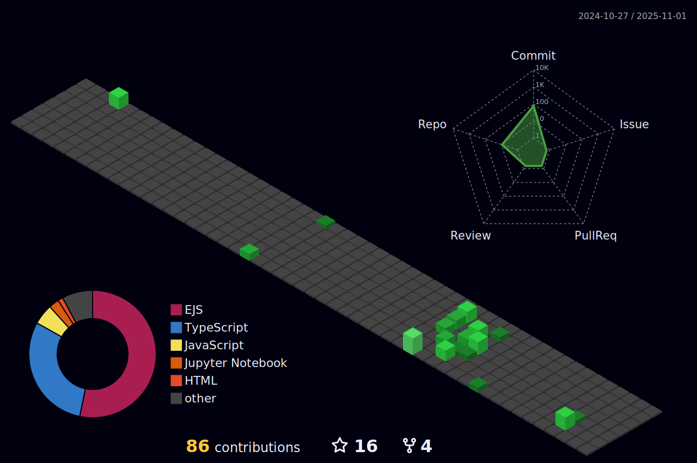

<h1 align="center">Hi 👋, I'm Harshwardhan Singh Panwar</h1>
<h3 align="center">A creative Web Developer using MERN stack</h3>

- 🌱 I’m currently learning **React , Figma**

- 👨‍💻 All of my projects are available at [https://harshwardhan.dorik.io/](https://harshwardhan.dorik.io/)

- 💬 Ask me about **JavaScript , MERN stack , Nodejs**

- 📫 Reach me at **harshwardhan9352@gmail.com**

- ⚡ **I do think out of the box**

<h3 align="left">Connect with me:</h3>

<h3 align="left">Languages and Tools:</h3>

                

# 📊 GitHub Stats:

 
  Visitor count 
  

 
 

  <h2> My Contributions </h2>
   
  
  
     

## GSSOC(24) Badges 🪶

  
  
  
  
  

  

  
 
 

